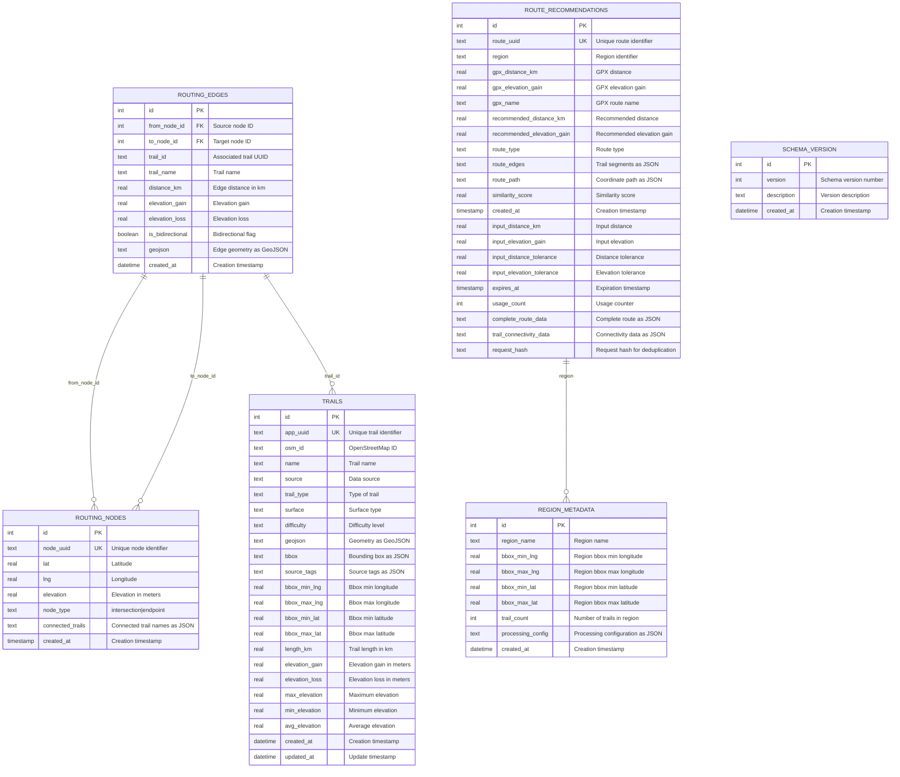

<div align="left">
  
</div>

# Carthorse SQLite Schema ERD (v9)

## Overview

The Carthorse SQLite schema is designed for trail data export and routing functionality. It uses SQLite without spatial extensions, storing geometry as GeoJSON strings for maximum compatibility.

**Schema Version**: 9  
**Geometry Format**: GeoJSON (TEXT)  
**Spatial Extensions**: None (pure SQLite)

## Entity Relationship Diagram



## Table Descriptions

### `trails` - Core Trail Data
The main table containing trail information with geometry stored as GeoJSON.

**Key Features:**
- **Geometry**: Stored as GeoJSON string for maximum compatibility
- **Unique IDs**: Each trail has a unique `app_uuid`
- **Elevation Data**: Comprehensive elevation metrics (gain, loss, min, max, avg)
- **Bounding Box**: Optimized bbox fields for spatial queries
- **Metadata**: Source information and trail classification

**Usage:**
```sql
-- Find trails by name
SELECT * FROM trails WHERE name LIKE '%boulder%';

-- Get trails within bbox
SELECT * FROM trails 
WHERE bbox_min_lng >= ? AND bbox_max_lng <= ? 
AND bbox_min_lat >= ? AND bbox_max_lat <= ?;

-- Get trails by length range
SELECT * FROM trails WHERE length_km BETWEEN 1.0 AND 10.0;
```

### `routing_nodes` - Intersection Points
Nodes representing trail intersections and endpoints for routing.

**Key Features:**
- **Node Types**: `intersection` (trails cross) or `endpoint` (trail ends)
- **Coordinates**: Latitude/longitude with optional elevation
- **Connectivity**: JSON array of connected trail names
- **Unique IDs**: Each node has a unique `node_uuid`

**Usage:**
```sql
-- Find intersection nodes
SELECT * FROM routing_nodes WHERE node_type = 'intersection';

-- Find nodes near a point
SELECT * FROM routing_nodes 
WHERE lat BETWEEN ? - 0.01 AND ? + 0.01
AND lng BETWEEN ? - 0.01 AND ? + 0.01;
```

### `routing_edges` - Trail Segments
Edges connecting nodes, representing trail segments for routing.

**Key Features:**
- **Bidirectional**: Most edges can be traversed in both directions
- **Trail Association**: Links to specific trails via `trail_id`
- **Distance/Elevation**: Segment-specific metrics
- **Geometry**: Edge path as GeoJSON

**Usage:**
```sql
-- Find edges from a specific node
SELECT * FROM routing_edges WHERE from_node_id = ?;

-- Get routing path between nodes
SELECT * FROM routing_edges 
WHERE from_node_id = ? AND to_node_id = ?;
```

### `route_recommendations` - Route Suggestions
Stored route recommendations with similarity scoring.

**Key Features:**
- **Multi-region**: Supports multiple geographic regions
- **GPX Integration**: Stores GPX route data for comparison
- **Similarity Scoring**: Numeric similarity to input routes
- **Expiration**: Routes can expire for freshness
- **Usage Tracking**: Counts how often routes are accessed

**Usage:**
```sql
-- Find similar routes
SELECT * FROM route_recommendations 
WHERE gpx_distance_km BETWEEN ? * 0.8 AND ? * 1.2
AND similarity_score > 0.7
ORDER BY similarity_score DESC;

-- Get routes by region
SELECT * FROM route_recommendations WHERE region = ?;
```

### `region_metadata` - Geographic Regions
Metadata about exported regions and processing configuration.

**Key Features:**
- **Bounding Box**: Geographic extent of the region
- **Trail Count**: Number of trails in the region
- **Processing Config**: JSON configuration used for export

**Usage:**
```sql
-- Get region information
SELECT * FROM region_metadata WHERE region_name = ?;

-- List all regions
SELECT region_name, trail_count, created_at FROM region_metadata;
```

### `schema_version` - Version Tracking
Tracks schema version for compatibility checking.

**Usage:**
```sql
-- Check current schema version
SELECT version, description FROM schema_version ORDER BY id DESC LIMIT 1;
```

## Indexes for Performance

### Core Indexes
```sql
-- Trails
CREATE INDEX idx_trails_app_uuid ON trails(app_uuid);
CREATE INDEX idx_trails_name ON trails(name);
CREATE INDEX idx_trails_length ON trails(length_km);
CREATE INDEX idx_trails_elevation ON trails(elevation_gain);

-- Routing Nodes
CREATE INDEX idx_routing_nodes_node_uuid ON routing_nodes(node_uuid);
CREATE INDEX idx_routing_nodes_coords ON routing_nodes(lat, lng);
CREATE INDEX idx_routing_nodes_elevation ON routing_nodes(elevation);

-- Routing Edges
CREATE INDEX idx_routing_edges_trail_id ON routing_edges(trail_id);
CREATE INDEX idx_routing_edges_from_node_id ON routing_edges(from_node_id);
CREATE INDEX idx_routing_edges_to_node_id ON routing_edges(to_node_id);
CREATE INDEX idx_routing_edges_from_node ON routing_edges(from_node_id, to_node_id);
CREATE INDEX idx_routing_edges_trail_distance ON routing_edges(trail_id, distance_km);
CREATE INDEX idx_routing_edges_elevation ON routing_edges(elevation_gain, elevation_loss);

-- Route Recommendations
CREATE INDEX idx_route_recommendations_uuid ON route_recommendations(route_uuid);
CREATE INDEX idx_route_recommendations_region ON route_recommendations(region);
CREATE INDEX idx_route_recommendations_distance ON route_recommendations(gpx_distance_km, recommended_distance_km);
CREATE INDEX idx_route_recommendations_elevation ON route_recommendations(gpx_elevation_gain, recommended_elevation_gain);
CREATE INDEX idx_route_recommendations_score ON route_recommendations(similarity_score);
```

## Data Types and Constraints

### SQLite-Specific Considerations
- **JSON Fields**: Stored as TEXT, validated at application level
- **Booleans**: Stored as INTEGER (0/1)
- **Timestamps**: Use DATETIME or TIMESTAMP
- **Geometry**: GeoJSON strings for maximum compatibility
- **Constraints**: CHECK constraints for enum values

### Field Constraints
```sql
-- Node type validation
node_type TEXT CHECK(node_type IN ('intersection', 'endpoint'))

-- Unique constraints
app_uuid TEXT UNIQUE NOT NULL
node_uuid TEXT UNIQUE
route_uuid TEXT UNIQUE

-- Required fields
name TEXT NOT NULL
geojson TEXT NOT NULL
lat REAL NOT NULL
lng REAL NOT NULL
```

## Migration Notes

### v8 to v9 Changes
- Added `route_recommendations` table with enhanced fields
- Added `processing_config` to `region_metadata`
- Enhanced indexes for better performance
- All JSONB fields changed to TEXT for SQLite compatibility

### Backward Compatibility
- v9 is backward compatible with v8
- New fields in `route_recommendations` are nullable
- Existing data continues to work without migration

## Usage Patterns

### Trail Querying
```sql
-- Get all trails in a region
SELECT * FROM trails WHERE bbox_min_lng >= ? AND bbox_max_lng <= ?;

-- Find trails by type
SELECT * FROM trails WHERE trail_type = 'hiking';

-- Get trails with elevation data
SELECT * FROM trails WHERE elevation_gain > 100;
```

### Routing Queries
```sql
-- Find nodes near a point
SELECT * FROM routing_nodes 
WHERE lat BETWEEN ? - 0.01 AND ? + 0.01
AND lng BETWEEN ? - 0.01 AND ? + 0.01;

-- Get routing path
SELECT * FROM routing_edges 
WHERE from_node_id = ? AND to_node_id = ?;
```

### Route Recommendations
```sql
-- Find similar routes
SELECT * FROM route_recommendations 
WHERE gpx_distance_km BETWEEN ? * 0.8 AND ? * 1.2
AND similarity_score > 0.7
ORDER BY similarity_score DESC;
```

## Performance Considerations

### Query Optimization
- Use bbox fields for spatial queries instead of geometry
- Leverage indexes on frequently queried fields
- Use JSON functions for querying JSON data in TEXT fields
- Consider query patterns when designing indexes

### Storage Optimization
- GeoJSON compression for large geometries
- Index only necessary fields
- Regular cleanup of expired route recommendations
- Monitor database size and performance

## Schema Version History

| Version | Description | Key Changes |
|---------|-------------|-------------|
| v8 | Initial SQLite schema | Basic trail and routing tables |
| v9 | Enhanced with route recommendations | Added route_recommendations table, enhanced indexes |

---

*This ERD documents the current SQLite schema v9 used by Carthorse for trail data export and routing functionality.* 